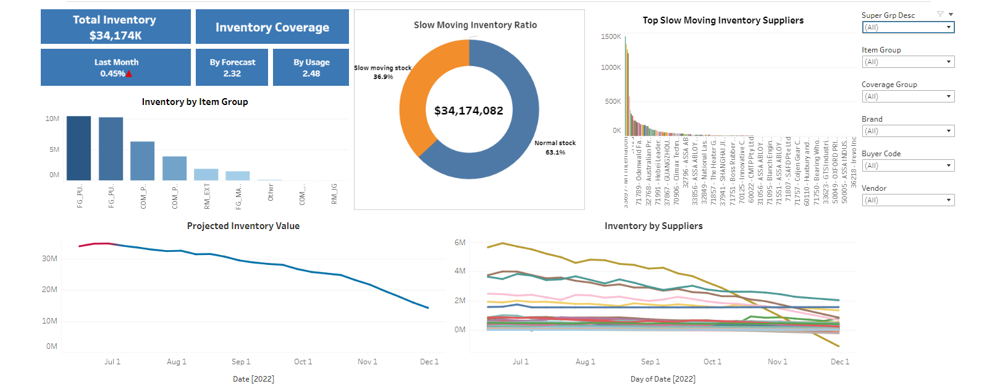
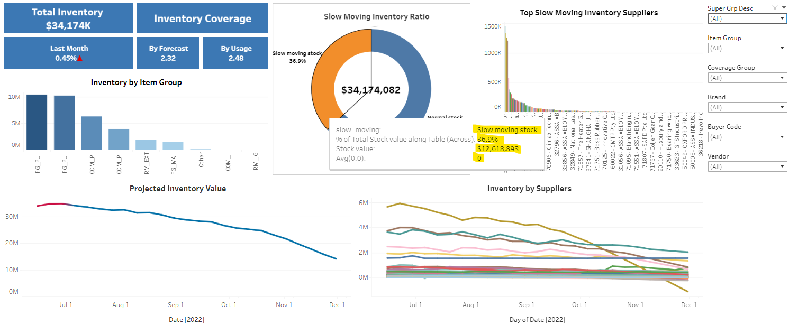
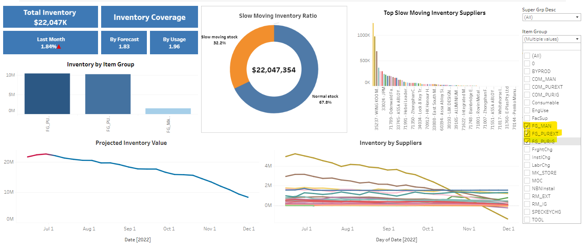
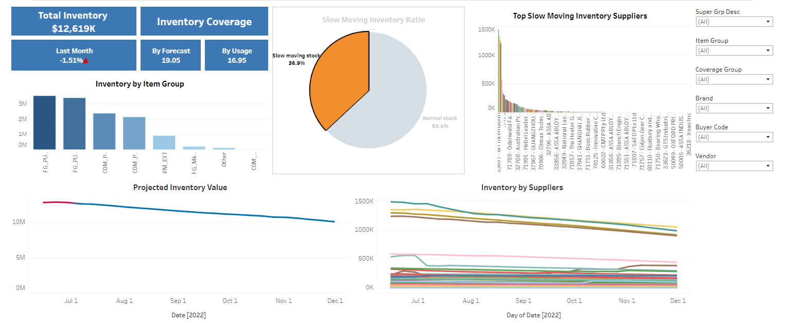

In this project, I built an inventory dashboard to help the operation manager monitor the inventory trends and take prompt decisions. For example, For example: ask the team to review the purchase order when the projected inventory goes up, review the forecast/sale plan when slow-moving stock goes up, identify the key suppliers to focus on...

## Tools used:
- Python
- Pandas
- Numpy
- Tableau

The raw data comes from 3 sources:
- Inventory file R0695: This file will have the data of current inventory (current stock on hand).
- Open PO: This file has the data on the incoming inventory (when and how much inventory will come).
- Forecast R0831: This file has the forecast of the items by months.

## Obstacle:
- The forecast only has the data by month, while the incoming inventory can come on any day within the month. If we project the inventory per monthly bucket, it will be inaccurate. I.e., if the incoming inventory is at the beginning of the month, the actual inventory will be much higher than the projected one.

## Solution:
- Using Pandas to manipulate the data to create the projected inventory by weekly bucket.
- The forecast was broken down from monthly to weekly. The incoming inventory date is rounded to the closest week date. The overdue purchase order will be projected to next week's inventory.
- The end-of-hand inventory is calculated and exported to a new file so that the historical data can also be reviewed.
- End on hand = Current stock on hand + incoming purchase order - forecast

At the end, we will have a projected inventory by weekly bucket. The data from the previous weeks was also saved and visualised to monitor the trends.

The inventory data was visualised using Tableau to create an interactive dashboard.

Below are the screenshots of what it looks like. 

-Overall dashboard: displays total inventory, top contributor, historical (red) and projected (blue) data, slow moving stock, stock by category, and so on.

-Additional information on hovering

-Master filtering

-Filter for connecting charts

## Insights that can be drawn from the dashboard:

- We can see that the projected inventory is going down, which is a good sign. However, it can also mean that current inventory on hand is too high ( increase of 0.45% from last month). 
- The inventory coverage is 2.4, which means the current stock is enough to cover the sale for the next two and a half months even without any incoming stock. This number also confirms that the current inventory is quite high. 
- The slow moving stock is at 33%, which means 1 third of the stock doesn't have good sales. These are the high-risk items with potential obsolescence if sales don't catch up. 
- Top suppliers are also shown. The manager can click on the interactive boards to see which suppliers contributed to high inventory and need to focus.

# Conclusion:
The inventory is too high and needs to be closely monitored (control purchase orders release, push out purchase orders...). The risk of obsolete stock is high. The sales team needs to look at promotions to reduce the high-risk stocks. The forecast team needs to review their forecast accuracy. A further investigation should be conducted to determine why the stock reached such a high level and to identify preventive measures (some possible causes: forecast inaccuracy, purchase order release error...).
